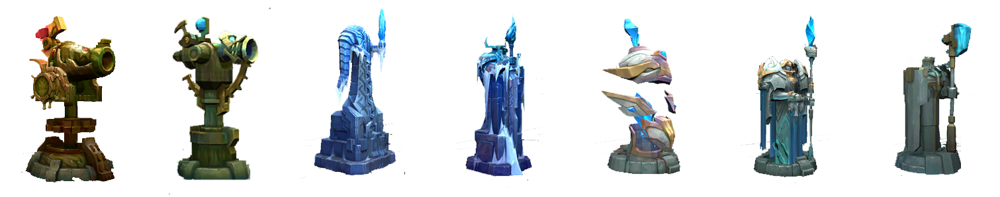
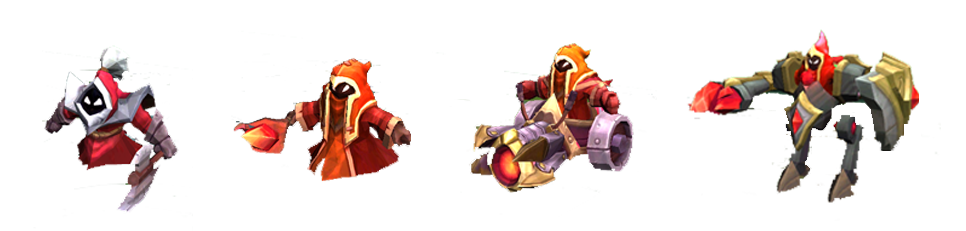

# Minions Have Spawned

Tower-defense like 3D game developed entirely in C++, using modern OpenGL bindings.

## Description

This game is based in the popular [League of Legends](https://leagueoflegends.com) MOBA game by [Riot Games](https://www.riotgames.com/en). It was primarily developed as an assignment to consolidate the knowledge obtained in the subject taught by the professor [Eduardo Gastal](https://inf.ufrgs.br/~eslgastal) - INF01047 - Fundamentals of Computer Graphics, within the scope of the Computer Science course, at the [INF](https://inf.ufrgs.br) - [UFRGS](https://ufrgs.br).

As the game background, a basic game engine was also developed using OOP, to make it easier to develop the game. This way, the code kernel isn't intended to have any OpenGL API call, using only the abstracted functions developed for the game engine.

## Especification
The game objective is to defend the ally nexus from the enemy minions, which spawn in the enemy nexus. To do so, the player can place several turrets (with different costs, effects and damages) trying to defeat the minions before they reach the ally nexus.

There are several waves spawning from the nexus, which can reach the target going through three different lanes, similar to how League of Legends works.

## Todo

Although the game mechanics is complete, there are still some implementation missing:
- [ ] Graphical Interface
- [ ] Loading Screen
- [ ] Better Shaders change
